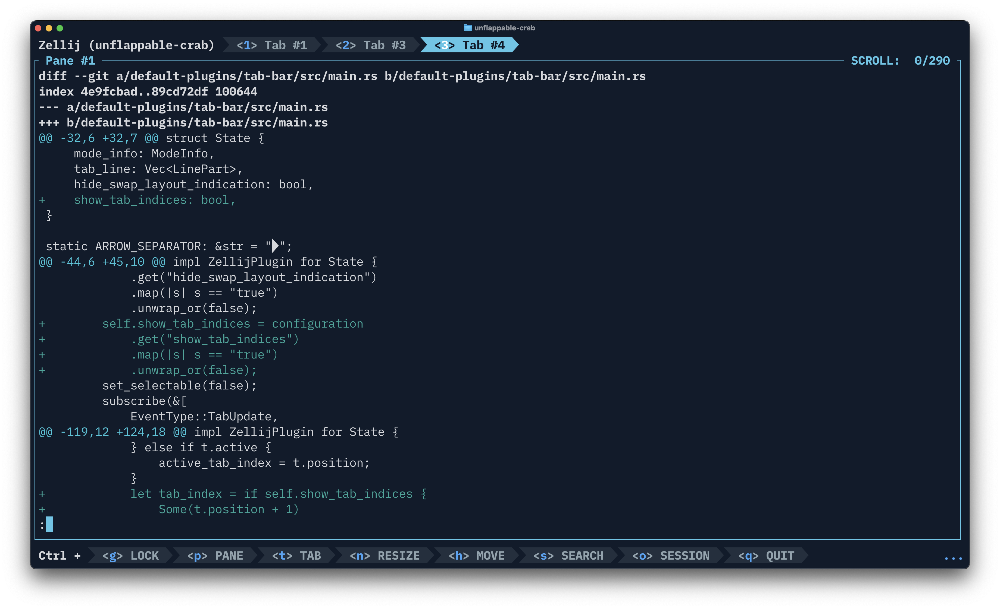

# zellij-tab-bar-indexed

The default [Zellij](https://zellij.dev/) tab-bar plugin with **one additional feature**: optional tab indices display.



## Why This Exists

This plugin is an extract of Zellij's built-in `tab-bar` plugin with a single addition: the `show_tab_indices` option that displays numeric indices (`<1>`, `<2>`, etc.) in tab labels.

This feature is proposed upstream in [zellij-org/zellij#4606](https://github.com/zellij-org/zellij/pull/4606). Until the PR is merged, this standalone plugin lets you use it today.

**When the PR is merged**, you can switch back to the built-in `zellij:tab-bar`.

## Installation

Add the plugin alias to your config (`~/.config/zellij/config.kdl`):

```kdl
plugins {
    tab-bar location="https://github.com/ivoronin/zellij-tab-bar-indexed/releases/latest/download/tab-bar.wasm" {
        show_tab_indices true
    }
}
```

### First Run - Grant Permission

On first launch, the plugin requests permission to read application state (required for tab/mode updates):

1. Start zellij
2. Press `Ctrl+p` (pane mode)
3. Press `k` to focus the tab-bar pane
4. Press `y` to grant permission

Permission persists for future sessions.

## Configuration

| Option | Type | Default | Description |
|--------|------|---------|-------------|
| `show_tab_indices` | bool | `false` | Show `<1>`, `<2>`, etc. in tab labels |
| `hide_swap_layout_indication` | bool | `false` | Hide swap layout indicator |

## Building from Source

```bash
rustup target add wasm32-wasip1
cargo build --release --target wasm32-wasip1
# Output: target/wasm32-wasip1/release/tab-bar.wasm
```

## License

MIT. Based on the default tab-bar plugin from [zellij-org/zellij](https://github.com/zellij-org/zellij).
